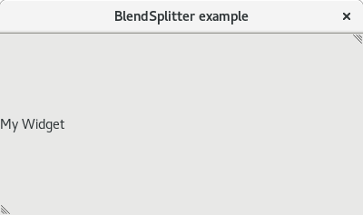

# BlendSplitter
A blender-like Qt Widget management library, version 3.

You can download the whole documentation in pdf on (https://genabitu.github.io/BlendSplitter/latex/BlendSplitter.pdf).

This library offers 2 kinds of functionality - one implemented by the BlendSplitter class, the other by the SwitchingWidget class. Although these are intended to be used together, each one of them can be used separately.

BlendSplitter
=============
This widget implements the functionality of Blender (Open-source 3D modelling software) widget management. This widget displays a splitter similar to QSplitter. However, each widget in BlendSplitter has a pair of Expanders (one in top right and one in bottom left corner). By dragging from these Expanders inwards a new widget is created in the direction of the drag. If the direction is different to that of the BlendSplitter, a new BlendSplitter with parallel direction is created in place of the widget with the widget and the new widget in it. By dragging from these expanders outwards, a neighbouring widget (or a collection of widgets) can be closed. While the mouse is held, the widgets to be closed are marked with black overlay. When the mouse is released, they are closed. BlendSplitter can be used like any other QWidget, although setting one as the central widget is recommended. A BlendSplitter can contain objects of any class inheriting from QWidget. Note that you have to manually set the initial state of the BlendSplitter. You need to add at least 1 widget, otherwise nothing will be displayed.

Example
-------
```C++
#include <QApplication>
#include <QMainWindow>

#include <BlendSplitter>

int main(int argc, char** argv)
{
    new QApplication{argc, argv};
    QMainWindow* window{new QMainWindow{}};
    BlendSplitter* splitter{new BlendSplitter{[]()->QWidget* {return new QLabel{"My Widget"};}}};

    window->setCentralWidget(splitter);
    window->resize(400, 200);
    window->setWindowTitle("BlendSplitter example");

    splitter->addWidget();

    window->show();
    return qApp->exec();
}
```
On Gnome 3.22, this example looks like:



Example with composite splitters
-------
```C++
#include <QApplication>
#include <QMainWindow>

#include <BlendSplitter>

int main(int argc, char** argv)
{
    new QApplication{argc, argv};
    QMainWindow* window{new QMainWindow{}};
    BlendSplitter* splitter{new BlendSplitter{[]()->QWidget* {return new QLabel{"My Widget"};}}};

    window->setCentralWidget(splitter);
    window->resize(400, 200);
    window->setWindowTitle("BlendSplitter example 2");

    splitter->addWidget();
    BlendSplitter* splitter2{new BlendSplitter{[]()->QWidget* {return new QLabel{"My Widget"};}, Qt::Vertical}};
    splitter->addSplitter(splitter2);
    splitter2->addWidget();
    splitter2->addWidget();

    window->show();
    return qApp->exec();
}
```
On Gnome 3.22, this example looks like:


SwitchingWidget
===============
This class displays a Widget with a SwitchingBar on the bottom. The widget displayed is one from WidgetRegistry and it can be selected using a combo box in the SwitchingBar. The SwitchingBar is like a QMenuBar, but can also contain plain widgets. A SwitchingWidget can contain objects of any class inheriting from QWidget.

Example
-------
```C++
#include <QApplication>
#include <QMainWindow>

#include <BlendSplitter>

int main(int argc, char** argv)
{
    new QApplication{argc, argv};
    QMainWindow* window{new QMainWindow{}};

    WidgetRegistry::getRegistry()->addItem();
    WidgetRegistry::getRegistry()->addItem("Type1", []()->QWidget* {return new QLabel{"Type 1 Label"};}, [](SwitchingBar* bar, QWidget*)->void {
        QMenu* menu{new QMenu{"My first menu"}};
        bar->addMenu(menu);
        QMenu* menu2{new QMenu{"My second menu"}};
        menu2->addAction(new QAction{"New", 0});
        menu2->addAction(new QAction{"Close", 0});
        bar->addMenu(menu2);
        QLabel* lab{new QLabel{"My third not-so-menu"}};
        bar->addWidget(lab);
    });
    WidgetRegistry::getRegistry()->addItem(new RegistryItem{"Type2", []()->QWidget* {return new QLabel{"Type 2 Label"};}});
    WidgetRegistry::getRegistry()->setDefault(1);

    SwitchingWidget* widget{new SwitchingWidget{}};

    window->setCentralWidget(widget);
    window->resize(600, 400);
    window->setWindowTitle("SwitchingWidget example");

    window->show();
    return qApp->exec();
}
```
On Gnome 3.22, this example looks like:


